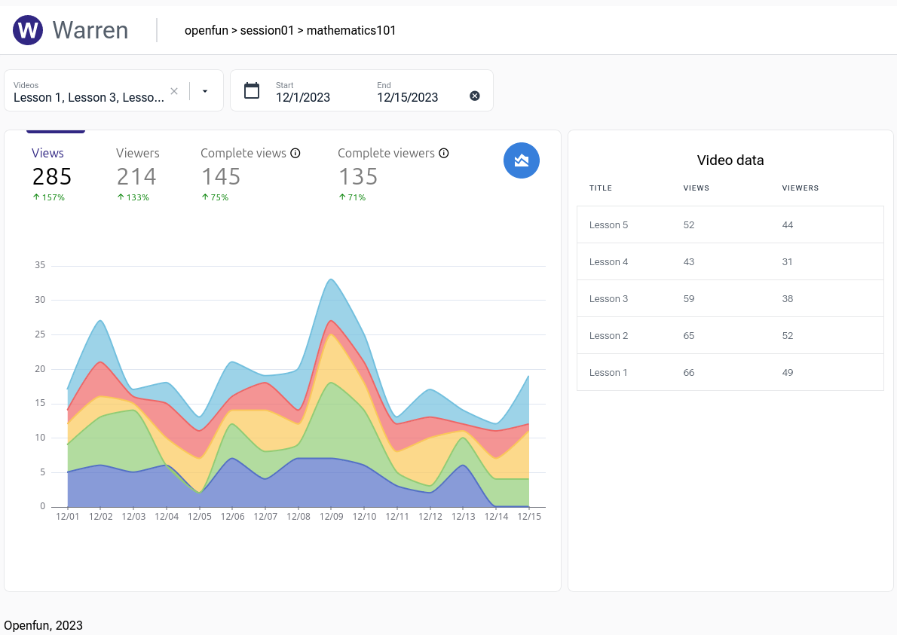

    

    _📊 A framework for your learning analytics (expect some xAPI ❤️)_

    
    
    
    
    

[Warren](/) is a framework for your learning analytics. Its key features are:

1. a simple Python interface to define indicators,
2. cacheable indicators calculation,
3. pluggable execution engines,
4. calculated indicators exposed _via_ an HTTP API,
5. [LRS](https://en.wikipedia.org/wiki/Learning_Record_Store) as a primary data source,
6. high extensibility thanks to a plugin-architecture,
7. [LTI](https://en.wikipedia.org/wiki/Learning_Tools_Interoperability) dashboards integration.

Warren also provides:

1. a light-weight implementation of ADLNet's [Experience Index](https://github.com/adlnet/xi-lite) (_aka_ XI), a core-component of the recommended [Total Learning Architecture](https://adlnet.gov/news/2020/01/20/ADL-Initiative-established-a-TLA-Sandbox-project/),
2. extensible indexers for popular LMSes (Moodle, OpenEdx) to feed the XI.

And finally, Warren also provides **web component** to build reactive, beautiful dashboards :heart_eyes:.

